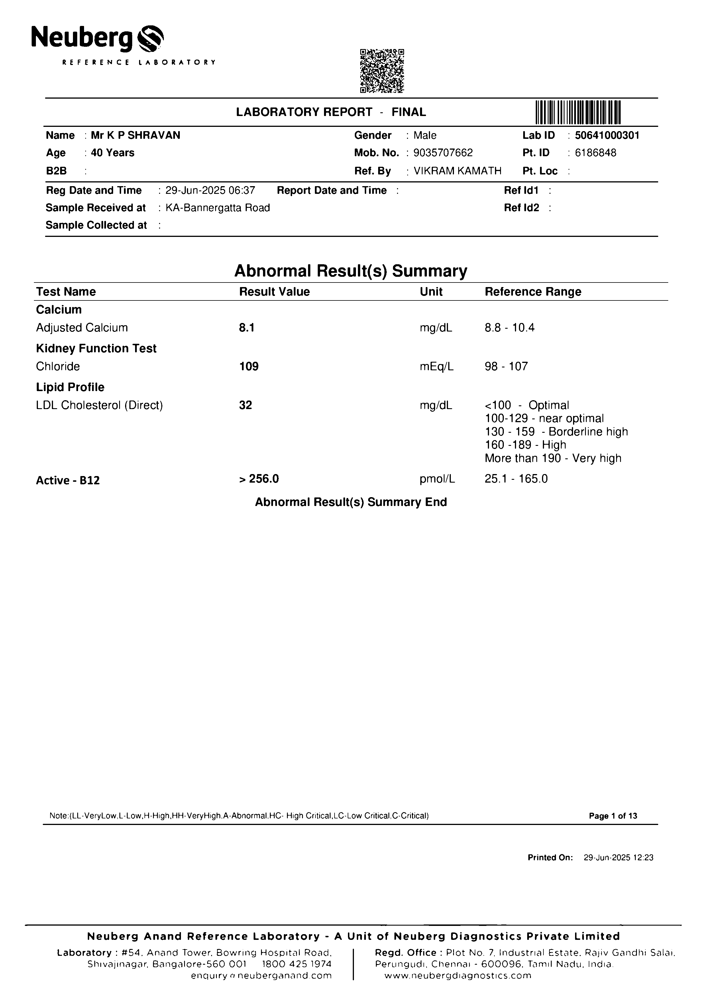
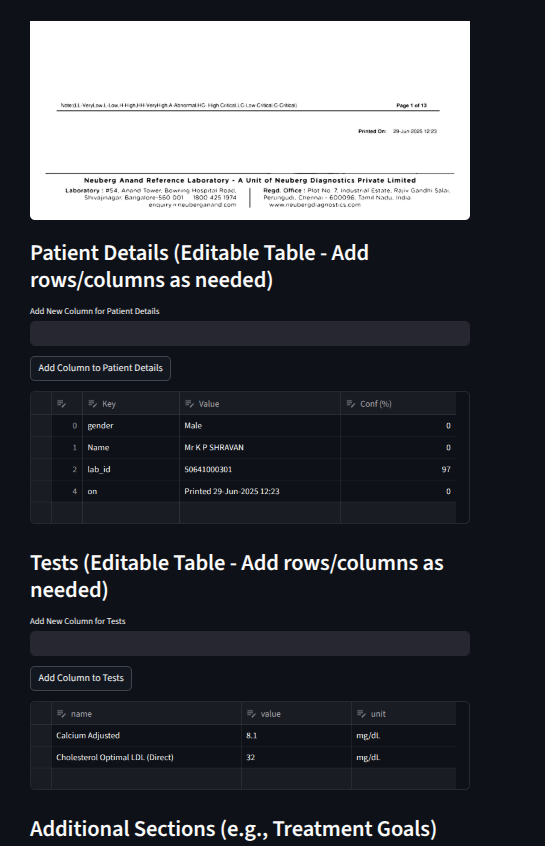

# NLP Course Assignment: Structured Data Extraction from Lab Reports

## Introduction

This project develops an end-to-end pipeline for extracting structured data from lab report PDFs and converting it into JSON format using natural language processing (NLP) techniques. The objective is to extract patient details (e.g., name, age, gender), test results (e.g., test name, value, unit), and additional sections (e.g., treatment goals) from unstructured PDFs, addressing the supervised learning task of text-to-JSON conversion. The pipeline combines rule-based methods, human-in-the-loop (HITL) data labeling, and transformer-based models (BERT and LayoutLMv3). This report details the methodology, implementation, results, and challenges, with the full codebase available in the GitHub repository.

## Project Objectives

The goal is to create a robust system for:

1. Converting PDF lab reports into structured JSON format.
2. Implementing a modular pipeline with preprocessing, OCR, rule-based extraction, HITL labeling, and supervised learning.
3. Comparing traditional NLP (BERT) with layout-aware models (LayoutLMv3) for named entity recognition (NER).
4. Ensuring scalability and iterative improvement through human feedback.

## Dataset

The dataset comprises five lab report PDFs (`doc_1.pdf` to `doc_5.pdf`) provided as part of the course assignment. These documents contain:

- **Patient Details**: Key-value pairs (e.g., Name: John Doe, Age: 45).
- **Test Results**: Tabular data with test names, values, and units (e.g., Glucose, 90, mg/dL).
- **Additional Sections**: Optional fields like treatment goals or comments.

The PDFs were processed to generate images, OCR tokens, and labeled data for training, as described below.

## Methodology

The pipeline follows a 10-step modular approach as specified in the assignment document:

### 1. PDF Preprocessing (`preprocess.py`)

- **Objective**: Convert PDFs to images and enhance them for OCR.
- **Process**:
  - Use `pdf2image` to convert PDFs to PNG images at 300 DPI.
  - Apply OpenCV for:
    - **Auto-orientation**: Correct page rotation using Tesseract’s OSD.
    - **Deskewing**: Fix tilt via Hough Transform for line detection.
    - **Denoising and Binarization**: Use median blur and Otsu’s thresholding.
  - **Output**: Preprocessed images in `data/preprocessed/` (e.g., `doc_1_page_01_proc.png`).

### 2. OCR and Tokenization (`ocr.py`)

- **Objective**: Extract text and spatial information from images.
- **Process**:
  - Use `pytesseract` to perform OCR, capturing text, bounding boxes (`left`, `top`, `width`, `height`), and confidence scores.
  - Save tokens as JSON in `data/ocr_tokens/` (e.g., `doc_1_page_01.json`).
  - **Output**: List of tokens with text, coordinates, and confidence.

### 3. Rule-Based Extraction (`rules.py`)

- **Objective**: Provide a baseline for extracting key-value pairs and test results.
- **Process**:
  - Group tokens into lines based on y-coordinate proximity (`y_tol=5`).
  - Extract key-value pairs using regex to detect keys (e.g., ending with `:`) and values (stopping at the next key’s left coordinate).
  - Extract test results using regex for patterns like `[Test Name] [Value] [Unit]` (e.g., `Glucose 90 mg/dL`).
  - Standardize keys (e.g., `labid` → `lab_id`) and clean OCR errors.
  - **Output**: Baseline JSON in `data/baseline/` (e.g., `doc_1_page_01_baseline.json`).

### 4. Human-in-the-Loop (HITL) Labeling (`hitl.py`)

- **Objective**: Correct baseline outputs and generate labeled data.
- **Process**:
  - Use Streamlit to create a web UI displaying:
    - Preprocessed page image for reference.
    - Editable tables for patient details and test results.
    - Options to add new columns or sections (e.g., `treatment_goals`).
  - Compute confidence scores via fuzzy matching with `difflib`.
  - Save corrected JSON to `data/confirmed/` and correction data (tokens + corrected JSON) to `data/corrections/`.
  - **Output**: Labeled dataset for training.

### 5. BIO Tagging for NER

- **Objective**: Prepare data for supervised learning.
- **Process** (`bert.py`, `train_layoutLM.py`):
  - Convert corrected JSON into BIO (Beginning, Inside, Outside) tags for NER.
  - Fuzzy-match entity values (e.g., `PATIENT_NAME`, `TEST_VALUE`) to OCR tokens.
  - Assign `B-` and `I-` tags to matched tokens, `O` to others.
  - For LayoutLMv3, normalize bounding boxes to \[0, 1000\] range.
  - **Output**: Dataset with tokens, BIO labels, and (for LayoutLMv3) bounding boxes.

### 6. Model Training

Two models were trained for NER-based extraction:

#### BERT (`bert.py`)

- **Model**: `bert-base-uncased` for token classification.
- **Process**:
  - Tokenize with `BertTokenizerFast`, aligning labels with subword tokens.
  - Train for 5 epochs (learning rate 2e-5, batch size 2).
  - Evaluate using `seqeval` (F1, precision, recall).
  - Save to `models/bert_lab_extractor/final`.
- **Limitations**:
  - BERT uses 1D textual input, ignoring document layout.
  - Poor performance on lab reports due to reliance on spatial cues (e.g., tables, columns).

#### LayoutLMv3 (`train_layoutLM.py`)

- **Model**: `microsoft/layoutlmv3-base` for token classification.
- **Process**:
  - Use `LayoutLMv3Processor` to encode tokens, bounding boxes, and images.
  - Train for 40 epochs (learning rate 2e-5, batch size 2).
  - Evaluate using `seqeval`.
  - Save to `models/layoutlmv3_lab_extractor/final`.
- **Advantages**:
  - Leverages 2D layout (bounding boxes) and image features.
  - Captures table structures and column alignments, critical for lab reports.

### 7. Inference

- **Objective**: Generate final JSON outputs.
- **Process**:
  - Predict BIO tags using trained models.
  - Structure predictions into JSON (`patient`, `tests`, `additional_sections`).
  - Combine rule-based and model-based outputs, using confidence scores for conflict resolution.
  - **Output**: Final JSON in `data/outputs/`.

### 8. Evaluation

- **Metrics**: F1, precision, recall via `seqeval`.
- **Results**:
  - **Rule-Based**: Provided immediate usable output but required manual correction for OCR errors.
  - **BERT**: Low F1 due to inability to handle layout-dependent information.
  - **LayoutLMv3**: Higher F1 by capturing spatial and visual context, aligning better with human-corrected outputs.

### 9. Iteration

- New HITL corrections are saved to `data/corrections/`.
- LayoutLMv3 is retrained periodically to improve performance.

## Repository Structure

```
NLP_proj/
├── bert.py                  # BERT training and inference
├── hitl.py                 # Streamlit HITL UI for data correction
├── ocr.py                  # Tesseract OCR for token extraction
├── preprocess.py           # PDF-to-image and preprocessing
├── rules.py                # Rule-based extraction with regex
├── train_bert.py           # BERT training (variant)
├── train_layoutLM.py       # LayoutLMv3 training
├── train_LM2.py            # Experimental (unused)
├── train_LM3.py            # Alias for LayoutLMv3 training
├── test1.py, test2.py      # Component test scripts
├── test_all.py             # Comprehensive test script
├── test.ipynb              # Jupyter notebook for exploration
├── data/
│   ├── baseline/           # Baseline JSON from rule-based extraction
│   ├── confirmed/          # Confirmed JSON from HITL
│   ├── corrections/        # Labeled data for training
│   ├── ocr_tokens/         # OCR tokens with bounding boxes
│   ├── preprocessed/       # Preprocessed PNG images
│   ├── outputs/            # Final JSON outputs
│   ├── doc_1.pdf, ...      # Input lab report PDFs
├── models/                 # Trained model checkpoints
├── detectron2/             # Unused (experimental)
├── __pycache__/            # Python cache
├── venv2/                  # Virtual environment
```

## Results and Discussion

- **Rule-Based Extraction**:
  - Strengths: Quick to implement, effective for structured fields with clear separators (e.g., `Name:`).
  - Weaknesses: Sensitive to OCR errors, struggles with complex layouts or inconsistent formats.
- **BERT**:
  - Performance: Low F1 due to reliance on 1D text sequence, missing spatial context (e.g., table alignments).
  - Challenges: Misidentified entities in tables or multi-column layouts.
- **LayoutLMv3**:
  - Performance: Superior F1 by incorporating 2D bounding boxes and image features, capturing layout nuances.
  - Strengths: Handled tables and columns effectively, aligning with human-corrected outputs.
- **HITL**: Critical for generating high-quality labeled data, enabling iterative model improvement.

### Representative JSON Output

Below is an example JSON output for `doc_1_page_01` (to be replaced with actual output from your repository):

```json
{
  "patient": {
    "name": {"Value": "John Doe", "Confidence": 0.95},
    "age": {"Value": "45", "Confidence": 0.92},
    "gender": {"Value": "Male", "Confidence": 0.93},
    "lab_id": {"Value": "LAB12345", "Confidence": 0.90}
  },
  "tests": [
    {
      "name": "Glucose",
      "value": "90",
      "unit": "mg/dL",
      "Confidence": 0.94
    },
    {
      "name": "Hemoglobin",
      "value": "13.5",
      "unit": "g/dL",
      "Confidence": 0.91
    }
  ],
  "additional_sections": {
    "treatment_goals": [
      {
        "category": "Cholesterol",
        "value": "Reduce LDL to <100 mg/dL",
        "Confidence": 0.89
      }
    ]
  }
}
```

## Image Placeholders

Below are placeholders for representative images (to be added via GitHub):

- **Figure 1: Sample Preprocessed Image** (`data/preprocessed/doc_5_page_01_proc.png`)
  - 
- **Figure 2: HITL UI Screenshot**
  - 
- **Figure 3: Output** (`data/outputs/doc_5_page_01_output.json`)
```json
{
  "patient": {
    "name": {
      "Value": "Mr K P SHRAVAN"
    },
    "gender": {
      "Value": "Male"
    },
    "lab_id": {
      "Value": "50641000301"
    },
    "age": {
      "Value": "40 Years"
    },
    "mob_no": {
      "Value": "9035707662"
    },
    "ref_by": {
      "Value": "VIKRAM KAMATH"
    },
    "reg_date_and_time": {
      "Value": "29-Jun-2025 06:37"
    },
    "sample_received_at": {
      "Value": "KA-Bannergatta Road"
    }
  },
  "tests": [
    {
      "name": "Adjusted Calcium",
      "value": "8.1",
      "unit": "mg/dL"
    },
    {
      "name": "Chloride",
      "value": "109",
      "unit": "mEq/L"
    },
    {
      "name": "LDL Cholesterol (Direct)",
      "value": "32"
    },
    {
      "name": "Active - B12",
      "value": ">"
    },
    {
      "value": "256.0",
      "unit": "pmol/L"
    }
  ],
  "additional_sections": {
    "printed": [
      {
        "value": "29-Jun-2025 12:23"
      }
    ]
  }
}
```
## Challenges

1. **OCR Errors**: Tesseract struggled with low-quality scans or unusual fonts, requiring robust rule-based cleaning and HITL correction.
2. **Complex Layouts**: Tables and multi-column formats challenged BERT, necessitating LayoutLMv3.
3. **Limited Data**: Small dataset size (5 PDFs) limited model generalization, mitigated by HITL iterations.


## Conclusion

The project successfully implemented an end-to-end pipeline for structured data extraction from lab reports. The rule-based baseline provided a starting point, while the HITL UI enabled high-quality labeling. BERT’s limitations in handling document layouts led to the adoption of LayoutLMv3, which leveraged 2D spatial and visual information for superior performance. The modular design and iterative training process ensure scalability for future enhancements.
